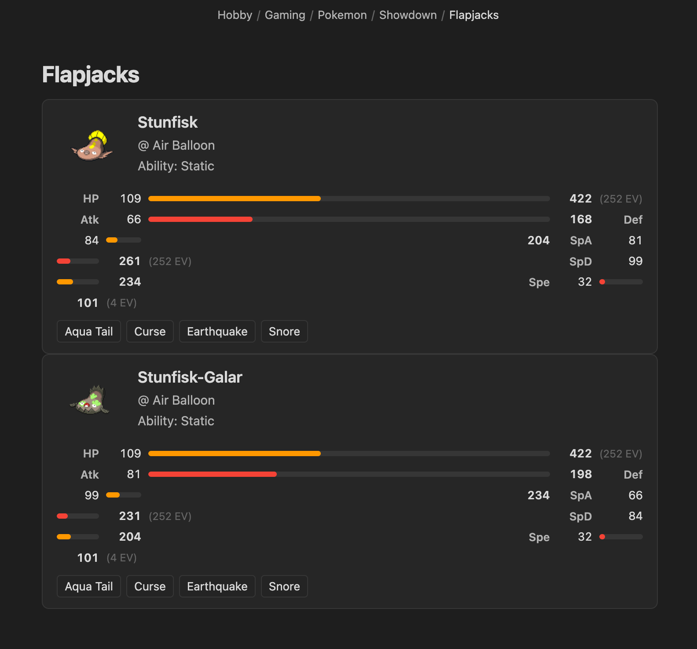

# Obsidian Showdown Viewer

A plugin that displays Pokémon built using [Pokémon Showdown's](https://pokemonshowdown.com/) team builder in [Obsidian](https://obsidian.md/) in a nice way.



## How to use

Copy your Pokémon team into a `showdown` code block:

```
Stunfisk @ Air Balloon  
Ability: Static  
Shiny: Yes  
EVs: 252 HP / 252 SpA / 4 Spe  
- Aqua Tail  
- Curse  
- Earthquake  
- Snore
```
